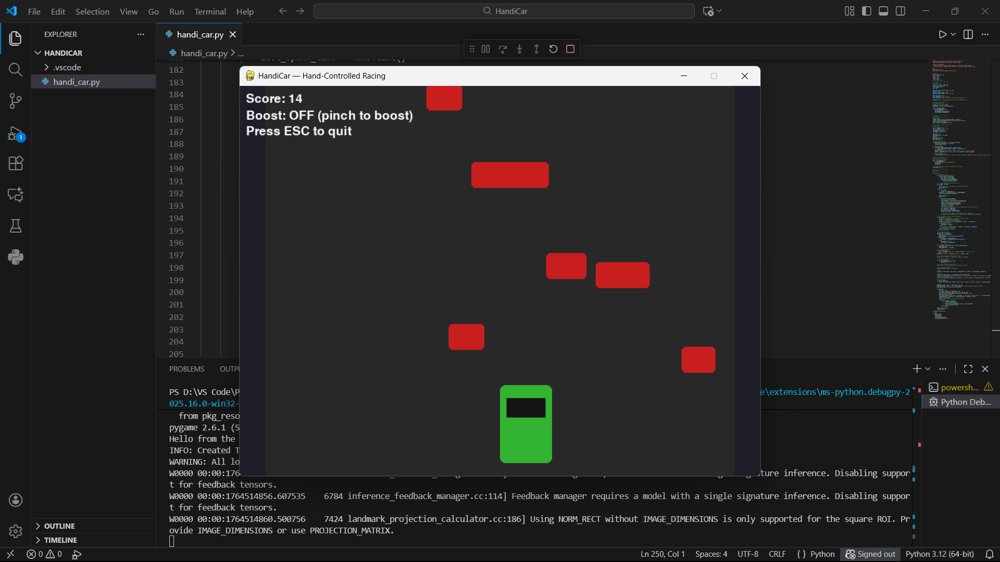

# HandiCar – Hand-Gesture Controlled Car Racing

HandiCar is a fun hand-gesture controlled racing game using your webcam.
Your index finger controls the car's left/right movement, and a pinch gesture (index + thumb) activates BOOST mode.

## Features:-

- Control car movement using hand landmarks via Mediapipe.
- Pinch gesture = Speed Boost
- Increasing difficulty with falling obstacles.
- Smooth movement using exponential filtering.
- Real-time webcam input displayed internally.
- Simple, single-file Python project.

## Packages:-
``` package
pip install mediapipe
pip install opencv-python
pip install pygame
pip install numpy
```
## How to Play!!
- Move index finger left → Car moves left
- Move index finger right → Car moves right
- Pinch (index finger + thumb close) → Activate BOOST
- Open hand (normal) → Normal speed

## Output



